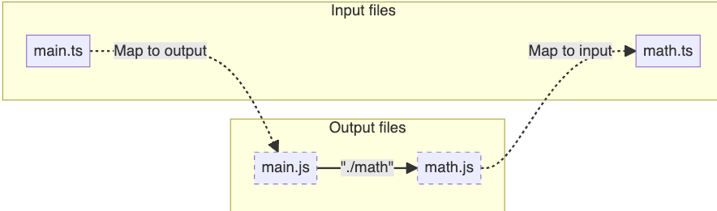

类型和变量不共享命名空间

## tsconfig.json

### include、typeRoots、types

ts 会递归查找 include 目录中所有的文件进行编译，在 include 中配置 types 目录，tsc 虽然不会编译输出对应的类型文件，但会将这些类型文件应用于类型检查;

ts 会查找 typeRoots 目录下所有类型文件用于类型检查，但不会递归查找子目录。

types 用于指定希望 ts 寻找 typeRoots 中目录下哪个包的类型。


## 全局类型声明与模块类型声明 

ts 通过文件中的**最外层** import 或 export 语句来判断是全局还是模块

对于模块类型文件，必须通过 import 引入， 而全局类型文件可以通过 reference 来引用

### declare 

declare 关键字用于声明已经存在于某个地方的变量、函数、类、命名空间或模块。它通常用于提供外部 JavaScript 代码的类型信息，
1.  声明全局变量
`declare const jQuery: (selector: string) => any;`

2. 声明全局函数
`declare function greet(name: string): void;`

3. 声明外部模块: 通常用于为没有类型定义的第三方库添加类型信息。
```ts
declare module "example-lib" {
  export function exampleFunction(param: string): number;
}

declare module "*.css";
```

4. 声明命名空间
`declare namespace MyLibrary {}`

5. 声明类
`declare class MyClass {}`

### @types
@types 作用域下的类型声明是由社区维护的中心化仓库(DefinitelyTyped)

当第三方库没有自带类型声明，且 @types 下也没有对应类型声明式，此时就需要通过 declare module 手动添加类型。

### namespace

namespace 可嵌套，内部 export 控制成员是否可在命名空间外部访问， 但当使用 declare namespace 时，其内部的 export 没有任何作用。


## modules 

ES 标准定义了 ES 模块的导入和导出如何进行链接，但没有定义如何查找这些文件，即模块解析。所以模块解析功能由宿主环境提供，而不同的宿主环境实现不一，因此需要通过 moduleResolution 选项来告知 typescript，宿主环境使用哪种模块解析方法

TypeScript 的模块输出格式不仅受 tsconfig.json 中 compilerOptions 的 module 选项控制，还受文件的扩展名和 package.json 文件中的配置影响。

### esmodule 与 commonjs
esmodule 和 commonjs 的主要区别在于 esmodule 是异步加载，且在编译时就能确定依赖关系，不需要手动处理依赖循环问题，即使使用动态 import，也能对动态导入的模块进行单独分块，而 commonjs 是同步加载，是完全运行时的，需要对代码进行上下文分析，打包器在分析依赖关系时将所有可能用到的模块绑定在一起，并手动处理依赖循环问题


### esm 与 cjs 互操作
对于 esm 与 cjs 互操作，大多数运行时环境和打包器可被分为三类策略：
1. 仅使用 ESM -- 如浏览器
2. 类似于 Bundler， 使用 ESM 语法编写代码，后转译为 CJS， 较宽松。
3. Nodejs - 在 nodejs 中， cjs 无法同步加载 ems，默认导入绑定为 exports 对象（打包器可能会将默认导入绑定为 exports.default 对象）

当 module 选项为 node16 或 nodenext， typescript 使用 nodejs 策略，否则使用类似于 Bundler策略。

typescript 不会转换模块标识符， 因此，模块说明符必须以一种适用于代码的目标运行时或打包器的方式编写，而理解这些输出相对说明符是TypeScript的工作。

typescript 通过输出映射-输入映射来找到对应对模块。



## decalration merging

不同模块不能进行声明合并

模块中进行全局声明: `declare global {  }`

### 合并 interface
非函数成员类型是唯一的，否则报错。
同一函数成员合并为重载， （如果一个签名有一个参数的类型是单一字符串字面值类型，那么它将被冒泡到其合并的重载列表的顶部）

### 合并 namespaces
namespace 的主要作用是用于组织代码，提供作用域和避免命名冲突。当 TypeScript 编译时，namespace 会被编译成相应的 JavaScript 代码，其中包含的内容会被封装在一个闭包中，以实现模块化的效果。

namespace 中的非导出成员，在另一个同一 namespace 声明中无法访问。

### 将 namespaces 与 interfalce、 classes、functions 和 enums 合并
将需要合并的成员通过 export 导出。

与 functions 合并时， namespace 中的成员将通过属性扩展到函数上,

namespace 中即可声明类型，也能声明值直接用于扩展对象，函数, 枚举等

### 模块增强
```ts
// observable.ts
export class Observable<T> {
  // ... implementation left as an exercise for the reader ...
}
// map.ts
import { Observable } from "./observable";
declare module "./observable" {
  interface Observable<T> {
    map<U>(f: (x: T) => U): Observable<U>;
  }
}
Observable.prototype.map = function (f) {
  // ... another exercise for the reader
};

```

## conditional type

SomeType extends OtherType ? TrueType : FalseType;

常用于定义泛型：
before:
```ts
interface IdLabel {
  id: number /* some fields */;
}
interface NameLabel {
  name: string /* other fields */;
}
 
function createLabel(id: number): IdLabel;
function createLabel(name: string): NameLabel;
function createLabel(nameOrId: string | number): IdLabel | NameLabel;
function createLabel(nameOrId: string | number): IdLabel | NameLabel {
  throw "unimplemented";
}
```

after: 
```ts
type NameOrId<T extends number | string> = T extends number
  ? IdLabel
  : NameLabel;

function createLabel<T extends number | string>(idOrName: T): NameOrId<T> {
  throw "unimplemented";
}
```

条件类型约束：`type MessageOf<T> = T extends { message: unknown } ? T["message"] : never;`

### 在条件类型中推断 infer
```ts
type GetReturnType<T> = T extends (...args: any[]) => infer R ? R : never;

type ElementType<T> = T extends (infer U)[] ? U : T;


type UnwrapPromise<T> = T extends Promise<infer U> ? U : T;

// 递归提取嵌套 Promise 的类型
type DeepUnwrapPromise<T> = T extends Promise<infer U> ? DeepUnwrapPromise<U> : T;

```

### 分配条件类型
```ts
type ToArray<Type> = Type extends any ? Type[] : never;

// 当传入联合类型时，则条件类型将应用于该联合类型的每个成员
type ToArray<Type> = Type extends any ? Type[] : never;
 
type StrArrOrNumArr = ToArray<string | number>; // equal string[] | number[];

// 可通过放括号来避免分配
type ToArrayNonDist<Type> = [Type] extends [any] ? Type[] : never;

type StrOrNumArr = ToArrayNonDist<string | number>; // equal (string | number)[];

```